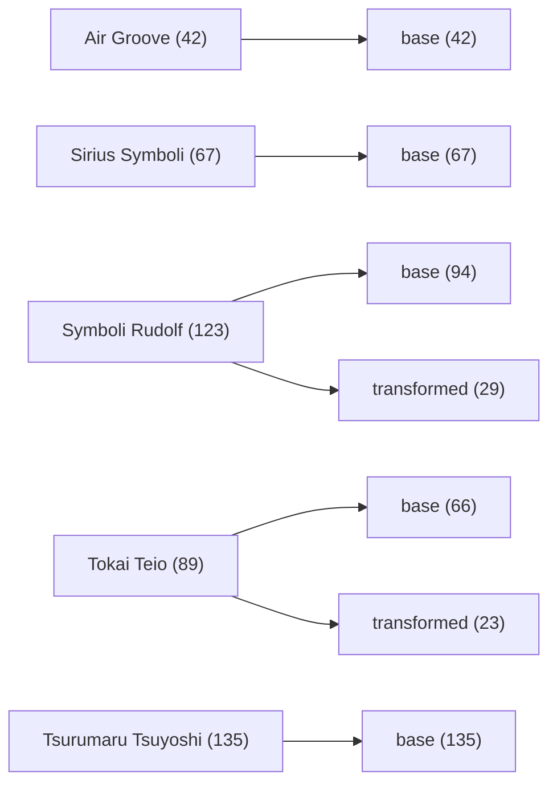

# Asset relationship map

Generated by analysis version `2026-08-25.1`. This report contains local evidence only; it does not identify authors or grant a licence.

2026-10-04 補充：以下保留初始內部同源分析；最新機器可讀關係圖另包含後續外部證據，目前為 **724 個節點／1,790 條關係**。第 2G 階段新增匿名開串者、同期原帖、8 個外部 GIF、待取得 ZIP 及影片年表事件，共 12 個來源節點／20 條來源間關係；沒有新增本地 GIF 作者命中或使用許可。詳見 [第 2G 階段報告](SOURCE_TRACE_PHASE2G_ZH_TW.md)。

第 2H 階段更新：目前為 **805 個節點／1,958 條關係**。已驗證取得該合集，新增製作日誌、日期主張、封包來源圖片與 79 條本地動畫透明輪廓連結，涵蓋 63 張 GIF；這些關係只確認輪廓／動作模板層，不代表完整 RGBA、表情、唯一作者或許可。第 2G 的「尚未取得」節點保留當時觀測，另以 `download_payload_hash_verified` 關係連到已取得檔案。詳見[第 2H 階段報告](SOURCE_TRACE_PHASE2H_ZH_TW.md)。

第 2I 階段更新：最新為 **811 個節點／1,966 條關係**。另分開記錄同期原帖的匿名雨衣改作者與自製素材包提供者，新增 6 個節點／8 條來源間關係；雨衣差分未與本地或 1 月合集精確命中，因此沒有新增本地作者連線、身分合併或利用許可。詳見[第 2I 階段報告](SOURCE_TRACE_PHASE2I_ZH_TW.md)。上述第 2G、2H 數量為各階段快照。

## Coverage

- GIF assets: **456**
- Named action groups: **186**
- Cross-character action-name groups: **33**
- Exact duplicate groups: **7**
- Decoded-equivalent animation groups: **7**
- Shared-first-frame groups: **7**
- Visual/timing template candidates: **183**

| Character | GIF count |
|---|---:|
| Air Groove | 42 |
| Sirius Symboli | 67 |
| Symboli Rudolf | 123 |
| Tokai Teio | 89 |
| Tsurumaru Tsuyoshi | 135 |

## Relationship hierarchy

## Highest-scoring cross-character template candidates

These are search priorities, not authorship conclusions.

| Score | Confidence | Source | Target | Evidence |
|---:|---|---|---|---|
| 0.911 | medium | `Sirius Symboli/idle_music_electricguitar-happy.gif` | `Symboli Rudolf/transformed/idle_music_electricguitar-happy.gif` | visual=0.854; alpha=0.854; frames=1.000; duration=1.000; bbox=0.981 |
| 0.911 | medium | `Sirius Symboli/idle_music_electricguitar-happy.gif` | `Symboli Rudolf/transformed/idle_music_electricguitar-smile.gif` | visual=0.854; alpha=0.854; frames=1.000; duration=1.000; bbox=0.981 |
| 0.908 | medium | `Sirius Symboli/idle_music_guitar-happy.gif` | `Symboli Rudolf/transformed/idle_music_guitar-happy.gif` | visual=0.823; alpha=0.875; frames=1.000; duration=1.000; bbox=0.980 |
| 0.905 | medium | `Sirius Symboli/idle_music_guitar-happy.gif` | `Symboli Rudolf/transformed/idle_music_guitar-smile.gif` | visual=0.812; alpha=0.875; frames=1.000; duration=1.000; bbox=0.980 |
| 0.904 | medium | `Air Groove/idle_lie-sleep.gif` | `Symboli Rudolf/idle_lie-exhausted-sleep.gif` | visual=0.812; alpha=0.865; frames=1.000; duration=1.000; bbox=0.997 |
| 0.897 | medium | `Sirius Symboli/idle_mix_dance-smile.gif` | `Symboli Rudolf/transformed/idle_mix_dance-laugh.gif` | visual=0.854; alpha=0.823; frames=1.000; duration=1.000; bbox=0.943 |
| 0.893 | medium | `Air Groove/idle_lie-sad.gif` | `Symboli Rudolf/idle_lie-happy.gif` | visual=0.812; alpha=0.844; frames=1.000; duration=1.000; bbox=0.952 |
| 0.893 | medium | `Air Groove/idle_lie-sad.gif` | `Symboli Rudolf/idle_lie-sad.gif` | visual=0.812; alpha=0.844; frames=1.000; duration=1.000; bbox=0.952 |
| 0.891 | medium | `Sirius Symboli/idle_mix_dance-smile.gif` | `Symboli Rudolf/transformed/idle_mix_dance-happy.gif` | visual=0.833; alpha=0.823; frames=1.000; duration=1.000; bbox=0.943 |
| 0.890 | medium | `Air Groove/idle_lie-sad.gif` | `Symboli Rudolf/idle_lie-exhausted.gif` | visual=0.802; alpha=0.844; frames=1.000; duration=1.000; bbox=0.952 |
| 0.887 | medium | `Air Groove/idle_lie-happy.gif` | `Symboli Rudolf/idle_lie-happy.gif` | visual=0.792; alpha=0.844; frames=1.000; duration=1.000; bbox=0.952 |
| 0.887 | medium | `Air Groove/idle_lie-happy.gif` | `Symboli Rudolf/idle_lie-sad.gif` | visual=0.792; alpha=0.844; frames=1.000; duration=1.000; bbox=0.952 |
| 0.884 | medium | `Air Groove/idle_lie-happy.gif` | `Symboli Rudolf/idle_lie-exhausted.gif` | visual=0.781; alpha=0.844; frames=1.000; duration=1.000; bbox=0.952 |
| 0.882 | medium | `Sirius Symboli/idle_rest-sleep.gif` | `Tsurumaru Tsuyoshi/idle_rest-smile.gif` | visual=0.812; alpha=0.812; frames=1.000; duration=1.000; bbox=0.948 |
| 0.881 | medium | `Air Groove/idle_lie-sleep.gif` | `Symboli Rudolf/idle_lie-sad-sleep.gif` | visual=0.729; alpha=0.865; frames=1.000; duration=1.000; bbox=0.997 |
| 0.881 | medium | `Air Groove/idle_lie-sleep.gif` | `Symboli Rudolf/idle_lie-sleep.gif` | visual=0.729; alpha=0.865; frames=1.000; duration=1.000; bbox=0.997 |
| 0.876 | low | `Sirius Symboli/idle_rest-angry-sleep.gif` | `Tsurumaru Tsuyoshi/idle_rest-smile.gif` | visual=0.792; alpha=0.812; frames=1.000; duration=1.000; bbox=0.948 |
| 0.874 | low | `Sirius Symboli/idle_rest-angry.gif` | `Tsurumaru Tsuyoshi/idle_rest-smile.gif` | visual=0.781; alpha=0.812; frames=1.000; duration=1.000; bbox=0.948 |
| 0.874 | low | `Sirius Symboli/idle_rest-sleep.gif` | `Tsurumaru Tsuyoshi/idle_rest-angry.gif` | visual=0.781; alpha=0.812; frames=1.000; duration=1.000; bbox=0.948 |
| 0.874 | low | `Sirius Symboli/idle_rest-sleep.gif` | `Tsurumaru Tsuyoshi/idle_rest-happy.gif` | visual=0.781; alpha=0.812; frames=1.000; duration=1.000; bbox=0.948 |
| 0.874 | low | `Sirius Symboli/idle_rest-sleep.gif` | `Tsurumaru Tsuyoshi/idle_rest-mad.gif` | visual=0.781; alpha=0.812; frames=1.000; duration=1.000; bbox=0.948 |
| 0.874 | low | `Sirius Symboli/idle_rest-sleep.gif` | `Tsurumaru Tsuyoshi/idle_rest-sleep.gif` | visual=0.781; alpha=0.812; frames=1.000; duration=1.000; bbox=0.948 |
| 0.871 | low | `Symboli Rudolf/idle_side_face_hand-happy.gif` | `Tokai Teio/idle_side_face_hand-angry.gif` | visual=0.812; alpha=0.802; frames=1.000; duration=1.000; bbox=0.868 |
| 0.871 | low | `Symboli Rudolf/idle_side_face_hand-happy.gif` | `Tokai Teio/idle_side_face_hand-sad.gif` | visual=0.812; alpha=0.802; frames=1.000; duration=1.000; bbox=0.868 |
| 0.871 | low | `Symboli Rudolf/idle_side_face_hand-sad.gif` | `Tokai Teio/idle_side_face_hand-angry.gif` | visual=0.812; alpha=0.802; frames=1.000; duration=1.000; bbox=0.868 |
| 0.871 | low | `Symboli Rudolf/idle_side_face_hand-sad.gif` | `Tokai Teio/idle_side_face_hand-sad.gif` | visual=0.812; alpha=0.802; frames=1.000; duration=1.000; bbox=0.868 |
| 0.871 | low | `Sirius Symboli/idle_rest-smile.gif` | `Tsurumaru Tsuyoshi/idle_rest-smile.gif` | visual=0.771; alpha=0.812; frames=1.000; duration=1.000; bbox=0.948 |
| 0.868 | low | `Symboli Rudolf/idle_side_face_hand-happy.gif` | `Tokai Teio/idle_side_face_hand-happy.gif` | visual=0.802; alpha=0.802; frames=1.000; duration=1.000; bbox=0.868 |
| 0.868 | low | `Symboli Rudolf/idle_side_face_hand-sad.gif` | `Tokai Teio/idle_side_face_hand-happy.gif` | visual=0.802; alpha=0.802; frames=1.000; duration=1.000; bbox=0.868 |
| 0.868 | low | `Sirius Symboli/idle_rest-angry-sleep.gif` | `Tsurumaru Tsuyoshi/idle_rest-angry.gif` | visual=0.760; alpha=0.812; frames=1.000; duration=1.000; bbox=0.948 |
| 0.868 | low | `Sirius Symboli/idle_rest-angry-sleep.gif` | `Tsurumaru Tsuyoshi/idle_rest-happy.gif` | visual=0.760; alpha=0.812; frames=1.000; duration=1.000; bbox=0.948 |
| 0.868 | low | `Sirius Symboli/idle_rest-angry-sleep.gif` | `Tsurumaru Tsuyoshi/idle_rest-mad.gif` | visual=0.760; alpha=0.812; frames=1.000; duration=1.000; bbox=0.948 |
| 0.868 | low | `Sirius Symboli/idle_rest-angry-sleep.gif` | `Tsurumaru Tsuyoshi/idle_rest-sleep.gif` | visual=0.760; alpha=0.812; frames=1.000; duration=1.000; bbox=0.948 |
| 0.865 | low | `Sirius Symboli/idle_rest-angry.gif` | `Tsurumaru Tsuyoshi/idle_rest-angry.gif` | visual=0.750; alpha=0.812; frames=1.000; duration=1.000; bbox=0.948 |
| 0.865 | low | `Sirius Symboli/idle_rest-angry.gif` | `Tsurumaru Tsuyoshi/idle_rest-happy.gif` | visual=0.750; alpha=0.812; frames=1.000; duration=1.000; bbox=0.948 |
| 0.865 | low | `Sirius Symboli/idle_rest-angry.gif` | `Tsurumaru Tsuyoshi/idle_rest-mad.gif` | visual=0.750; alpha=0.812; frames=1.000; duration=1.000; bbox=0.948 |
| 0.865 | low | `Sirius Symboli/idle_rest-angry.gif` | `Tsurumaru Tsuyoshi/idle_rest-sleep.gif` | visual=0.750; alpha=0.812; frames=1.000; duration=1.000; bbox=0.948 |
| 0.862 | low | `Symboli Rudolf/idle_side_face_hand-happy.gif` | `Tokai Teio/idle_side_face_hand-smile.gif` | visual=0.781; alpha=0.802; frames=1.000; duration=1.000; bbox=0.868 |
| 0.862 | low | `Symboli Rudolf/idle_side_face_hand-sad.gif` | `Tokai Teio/idle_side_face_hand-smile.gif` | visual=0.781; alpha=0.802; frames=1.000; duration=1.000; bbox=0.868 |
| 0.862 | low | `Sirius Symboli/idle_rest-smile.gif` | `Tsurumaru Tsuyoshi/idle_rest-angry.gif` | visual=0.740; alpha=0.812; frames=1.000; duration=1.000; bbox=0.948 |
| 0.862 | low | `Sirius Symboli/idle_rest-smile.gif` | `Tsurumaru Tsuyoshi/idle_rest-happy.gif` | visual=0.740; alpha=0.812; frames=1.000; duration=1.000; bbox=0.948 |
| 0.862 | low | `Sirius Symboli/idle_rest-smile.gif` | `Tsurumaru Tsuyoshi/idle_rest-mad.gif` | visual=0.740; alpha=0.812; frames=1.000; duration=1.000; bbox=0.948 |
| 0.862 | low | `Sirius Symboli/idle_rest-smile.gif` | `Tsurumaru Tsuyoshi/idle_rest-sleep.gif` | visual=0.740; alpha=0.812; frames=1.000; duration=1.000; bbox=0.948 |
| 0.859 | low | `Air Groove/idle_lie-sad.gif` | `Tokai Teio/idle_lie-cry.gif` | visual=0.771; alpha=0.792; frames=1.000; duration=1.000; bbox=0.901 |
| 0.859 | low | `Symboli Rudolf/idle_lie-happy.gif` | `Tokai Teio/idle_lie-happy.gif` | visual=0.750; alpha=0.823; frames=1.000; duration=1.000; bbox=0.858 |
| 0.859 | low | `Symboli Rudolf/idle_lie-happy.gif` | `Tokai Teio/idle_lie-sleep.gif` | visual=0.750; alpha=0.823; frames=1.000; duration=1.000; bbox=0.858 |
| 0.859 | low | `Symboli Rudolf/idle_lie-sad.gif` | `Tokai Teio/idle_lie-happy.gif` | visual=0.750; alpha=0.823; frames=1.000; duration=1.000; bbox=0.858 |
| 0.859 | low | `Symboli Rudolf/idle_lie-sad.gif` | `Tokai Teio/idle_lie-sleep.gif` | visual=0.750; alpha=0.823; frames=1.000; duration=1.000; bbox=0.858 |
| 0.859 | low | `Symboli Rudolf/idle_side_face-happy.gif` | `Tokai Teio/idle_side_face-happy.gif` | visual=0.781; alpha=0.792; frames=1.000; duration=1.000; bbox=0.868 |
| 0.859 | low | `Symboli Rudolf/idle_side_face-sad.gif` | `Tokai Teio/idle_side_face-happy.gif` | visual=0.781; alpha=0.792; frames=1.000; duration=1.000; bbox=0.868 |

## Interpretation limits

- A shared filename prefix establishes a project naming relationship, not common authorship.
- A high perceptual score suggests similar silhouettes, timing, or poses; it can still be coincidental or derive from a community template.
- Exact binary or decoded equality is strong sameness evidence, but still does not identify who created the file.
- Author, source URL, permission scope, and upstream rights remain `not_researched` until external evidence is collected.
